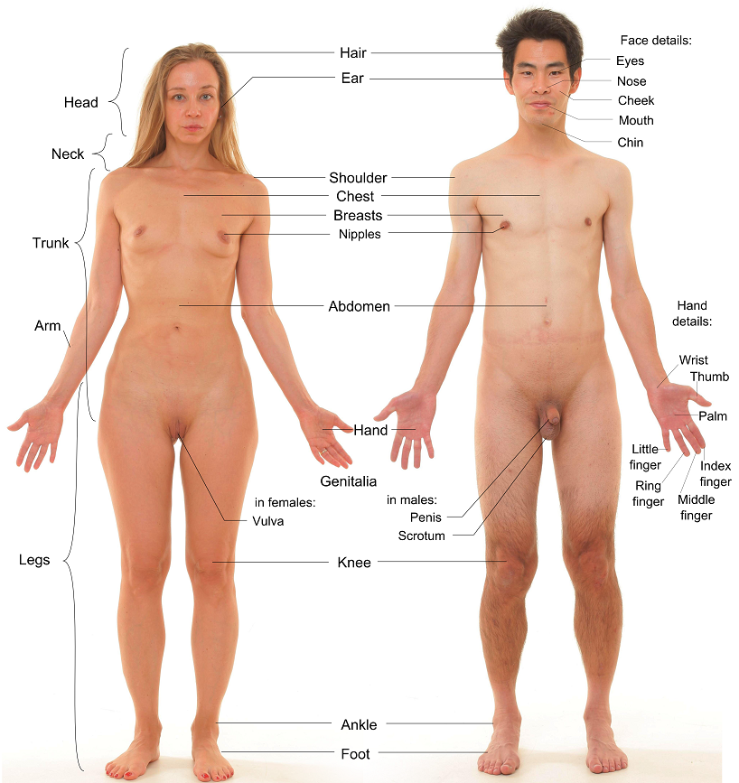

# Prayer to Humanity

### Suffering ensues resulting in our loss of humane substance and our highest potential is reduced to dishonest economic success, endless conflict and a compromised, unsustainable life.

###### (By File:Anterior view of human female and male, with labels.jpg: Mikael HäggströmDerivative work: nagualdesign - This file was derived from: Anterior view of human female and male, with labels.jpg:, CC0, https://commons.wikimedia.org/w/index.php?curid=18150192)

A lot of detriment is inflicted on our collective lives simply through needing to maintain narratives of ourselves or our ancestors. Instead of focusing on the most humane act of our present, we turn a blind eye to each other’s real needs and project exaggerated narratives about their malevolence which we must maintain endlessly to absolve our culpability in the atrocities these projections cause and fulfil.

As generations go by suffering and disharmony ensues resulting in our loss of humane substance and our highest potential is reduced to dishonest economic success, endless conflict and a compromised, unsustainable life.

Our hearts must break open and give rise to ‘humane truth’ in our lived experiences. Only when we find our highest ‘humane truth’ and act towards it will we deconstruct senseless factional disputes and the fake-truth that maintains economic advantage. This is a necessity for future generations and our responsibility to break away from self-serving deception.

In a post-deception world, allegiances based on authenticity strive for shared humane purpose. The principle upon which the information ecology is formed is authentic and based in humane action, this filters into our lives and children will no longer need to leave their morals at the door to function in society.

My heart breaks for children’s lives destroyed by war, war crimes, ethnic cleansing and genocide.

I guess this is a little weird, but here is my prayer for Humanity.

## Prayer To Humanity

Filled with sorrow, I pray,
that a single lamb might be enough
to keep our self-inflicted darkness at bay.

In despair and exasperated cries,
we face terrifying brutality and genocide.
Its unanimous tragedy obscured, and unfelt.

Redemption in this grief and torment arrives
by the balancing hand of the truth it brings.
Its absence would be devoid of meaning.

May we use this catastrophe to end it,
the momentum of our inhumane self-glorification,
willful ignorance, and selective blindness.

May we realize authentic compassion
worthy of the suffering we have caused in  
our complete disdain for moral truthfulness.

pay gratitude to God, and in spirit,
for this tragic sacrifice of innocence and
the foundation it paves for a more humane, humane.

May we unite as one, together with kindness
and defend the most honorable truth.
Hearts break open, yours can too.

Lee Tagg

Voilà!