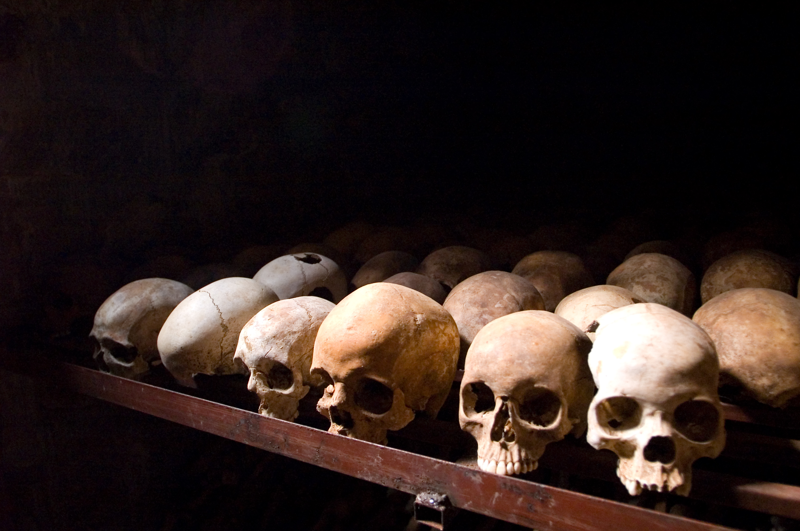

# Hiding Human Tragedy

### Corrupted, immoral and narcissistic. News media justifies or hides one form of human suffering while condemning another.

###### By I, Inisheer, CC BY-SA 3.0, https://commons.wikimedia.org/w/index.php?curid=2529242

## Accountability

Media organizations that enforce specific narrative responses to the suffering of outside groups are responsible for disrupting the understanding required to make informed, compassionate decisions on behalf of innocent and vulnerable people.

These organizations have access to evidence of grave human suffering, human rights abuses, breaches of international law, and genocide, yet they choose to cast doubt over its legitimacy, refute it, or refuse to report on it. 

This is without question, corrupted, immoral and narcissistic behavior that undermines the legitimacy of the media we consume and the organizations and governments that sponsor it. They are accountable for their lack of action towards the growing human cost and perpetuation of suffering inflicted on innocent lives.

## Compassion

Having compassion for others is crucial to creating a fair and equitable world for everybody. Compassion doesn’t just spring up as a narcissistic meme we can hijack and throw around, it actually has to be backed by substance.

An important aspect of compassion is understanding its lifecycle and it’s crucial to understand because the lifecycle gets disrupted by corrupt media sources and this stops the formation of compassion for others.

## Lifecycle of Togetherness

In the lifecycle of togetherness, we suffer, we learn from each others suffering, we develop compassion and arrive at togetherness; overcoming the pain we have caused one other with kindness and shared values. 

Suffering is the precursor to compassion and compassion brings us into togetherness. Our togetherness strengthens our resolve for peace, offers warmth and sympathy for our histories, and shares respect for our heritage. 

This lifecycle is a foundation of healthy, evolving civilization.

## Disrupted Compassion

The evolution of civilization towards compassionate conflict-resolution and peace while moving away from aggression and war is incongruent with nation states utilizing disharmony to gain additional power and control for their own benefit. For this reason our compassion for one another is intentionally disrupted by those in power as a means of dissolving our capacity to shift towards compassionate conflict resolution which would limit their capture of power. They do this by manipulating the truth, obfuscating and controlling news media to maximize the perception of our pain, and minimize the perception of the outsiders suffering.

In conflict, compassion empowers an alternative path to resolution that avoids retaliation, aggression and violence. Compassionate resolution of conflict aligns with human kindness and desire for peace. It is crucial in overcoming the barriers we face in the world today. 

## Measuring Pain

No amount of retaliation heals suffering. You cannot know in a single moment how deeply another person has suffered or how it compares to your own pain. That is not to trivialize adversity or mistreatment, but to say a painful experience resulting in retaliation is never measured exactly enough to reach a justifiable end. 

All efforts exerted in retaliation end up perpetuating suffering in arbitrary increments, back and forth endlessly, often outlasting the lifespan of the original progenitors. Using your suffering as the cause for someone else's suffering fails to heal the wound. It only perpetuates a cycle that will eventually re-offend you and your lineage and this is used as a mechanism of control to keep you engaged in aggression and resolution without compassion.

## Disconnecting People

Minimising or distorting people's exposure to others suffering suffocates our ability to feel compassion. We cannot have compassion for others when their suffering is hidden from us, we are made to feel like our compassion is an act of terrorism, their suffering is psychological warfare against us or deepfake generated propaganda. 

## Corrupted Media

When we understand this we also understand how instrumental news media is in perpetuating hatred and division around the world when it would otherwise be so easy for us to experience compassionate resolution without media interference. But, reporting on evidence of human suffering may be detrimental to news organizations resulting in loss of funding, government sponsorship or advertising revenue. 

This dynamic means each media organization's existence is dependent on its corruptibility. It can only function in alignment with coercive power structures that sponsor it. 

On top of this, if reporting on human rights abuses, breaches of international law or genocide are simply a decision of political alignment, the callous disregard for human tragedy of such events by media organisations shows they are incapable of compassion for the innocent and vulnerable and this is biased and immoral. 

Reporting on evidence is only done in cases where it makes the media organization or sponsor look good which is narcissistic and indicative of runaway, out-of-control power, incapable of course correction, accepting mistakes or serving society in a way that resonates with an expectation of aspirational humanity. 

Since this is the situation for western media, I am left wondering what combination of corrupt, immoral narcissism undermines our civilization and if there is hope for western media? I wonder what restructure of governance is required to reintroduce a semblance of integrity and authenticity?

## Hiding Human Tragedy

There is no hierarchy of suffering, just our desire to create more or less of it. To pick up the vulnerable and care for them, or to crush them into the dirt. Manipulation of the truth and false-narratives exacerbate the hardship and suffering felt by all people. 

The media we consume justifies or hides one form of suffering while condemning another and this cripples the lifecycle of togetherness and is corrupted, immoral and narcissistic. 

Honest journalism and reporting may not eliminate suffering, but it would aid in the development of compassion, leading to togetherness and world peace.

## Suffering

In this context, suffering is defined by its association with international conflict, colonial mistreatment, cultural or social prejudice, hardship, injustice, cruelty, discrimination and violence that is systemic, widespread or too complex and ingrained to be dealt with effectively under a single legal system of common law. 

The resolution of suffering has always been to perpetuate a cycle of retaliation or eradication in one direction or another. We know this doesn't work, war does not create peace and if it did, we would already have peace.

The way we disseminate information today is tightly coupled to power structures that solve problems through retaliation and war rather than seeking to engage in the lifecycle of togetherness that would be more beneficial in solving human suffering.

## Love Not War

It's honestly up to you. The good guys have always been characterized by their unconditional kindness, compassion and desire for peace. 

If that's not you, then it's time to consider the legacy you wish to leave for your children. Is it togetherness or war? Hate crimes or good times?