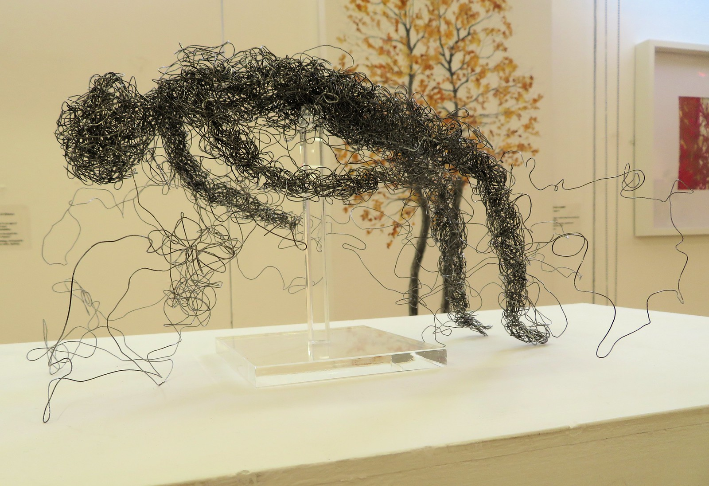

# Expulsion

### So you've been expelled. Perhaps fragility of the community was the problem. A matter of culture, inclusivity and anti-fragility.

###### At the RBSA in Birmingham."Oblivion" by Jackie Langfeld.Wire, acrylic

I don't remember the year, but I will say it was 2020 when I developed a special interest in a now discontinued community started by David Fuller and Alexander Beiner under the "Rebel Wisdom" moniker. Rebel Wisdom was an insightful media platform focussed on making sense of the world, the exploration and development of ideas that tackle civilizational-decay and societal dysfunction while exploring tangible action towards the problem but also developing community around sense-making and rebuilding civilization in resilient and an anti-fragile way. This was potentially a place where I would find friends and establish relationships with like-minded individuals. It wasn't something I took lightly and I guess I was slightly nervous about creating the right impression.

This interest developed prior to learning of my Autism and ADHD. It was really only post-diagnosis that I became psychosocially aware and even though I had these intuitions that I wanted to make the world a better place, I didn't have the emotional intelligence or skills and mechanisms for communicating well, handling others negative perceptions or criticism.

I lasted in the community for about 10 days before facing my expulsion due to an incident of my outrage and appalling language as a result of dysregulation which is cringe-worthy but funny to write down now. At the time it was a personal catastrophe and I now understand that I entered into a period of autistic burnout as a result. It was really my partner and my workplace that paid the price of my burnout, skill regression, loss of executive function, motivation, direction, and it was just a confusing and derailing time in our lives. How the expulsion went down was that I had started a conversation within the community under a special subsection of their forum designed for "developing healthy conversational debate" fostering balance over bias (or something like that). I chose the unfortunately char-grilled but polarizing “hangry” landscape of ketogenic verses vegan diet choice.

Obviously I was asking to have my ass handed to me with a side of greens, but I wasn't prepared for my own inadequacies under the circumstances. I made an argument for the ketogenic side and anticipated the vegan constituent of the community would balance the discussion and respond with a compelling case which I would eventually reign supreme and defeat with my crystalline common sense. The polarity of the topic wasn't an issue, I was equipped and prepared to chat openly about the scientific, emotional and spiritual aspects of the conversation having studied biology over the previous year and having grown up vegetarian I felt I had a rounded understanding of both sides of the debate.

What actually happened took me by surprise and I came face to face with my own cognitive rigidity. I'm paraphrasing and almost certainly misremembering the nuance but someone mentioned the intelligence of squid and the fact that eating their cells caused the spiritual/emotional trauma of the animal to be ingested and retained within the body of its consumer, and it was equivalent to receiving someone else's bad luck. I mistook their response as a joke or an intentionally argumentative device for derailing the authentic conversation (which I thought was part of the conversational game we were engaged in) and responded back with sarcasm which led to a reprimand for not honoring the spirit of the debate. At this point I basically went into cognitive shutdown because of the misunderstanding and humiliation of being told off like a naughty child in a community I sought belonging. I lost control, and responded in colorized (probably magenta or red), heading font for "everybody in the community to go and fuck themselves!!!". The next morning I deservingly and unsurprisingly woke up to a message from David Fuller telling me my kind of ignorance and manner wasn’t welcome within the community I was to be expelled immediately.

There is no excuse for the way I responded to the forum, but the thing that keeps running through my mind is that expulsion isn't the kindest way to deal with such problems. When we struggle to meet eye to eye on an issue and one party clearly has a problem with dysregulation, expelling them from the community is counter to the spirit of what the community was about. I can't help but see this as a failure of the community to achieve its stated goals.

Conscious beings will always be in various degrees of dysregulation at any given time. It's a matter of inclusivity and cultural anti-fragility to be able to handle the imperfect edges and flaws of the interpersonal experience without winding up at the expulsion of people, identities, cultures, or principles (you get the idea). Perhaps the fragility of our communities is the problem that needs tackling the most. Rather than pointing the finger outwards, we can look at ourselves as a group and see that the exclusion of others truth is a failure to achieve togetherness. Understanding the dysregulation of an individual is an opportunity to become more tolerant and inclusive, it can turn a disruptive negative experience into something healing and beneficial to the community building resilience. Expulsion is a failure of the group to respond to adversity in a healthy, supportive way.

It is important to be compassionate towards others and not automatically assume their dysregulation is a sign of bad character or intentional malice. Concentrating on unconditional kindness and seeking to understand the dynamic of dysregulation helps us establish cultures of anti-fragility and to create inclusive communities that know how to handle unexpected disruptions positively.