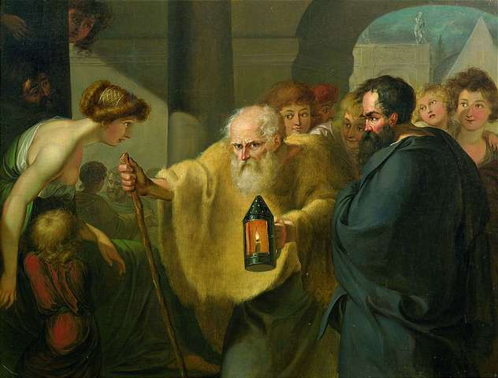

# Unhealed Things

### Some things are too unhealed and twisted to heal without stripping away the false narratives and shining a light on what they really are and it's okay to walk away to pursue healed things.

###### By Attributed to Johann Heinrich Wilhelm Tischbein - Nagel Auktionen, 2005, Public Domain, https://commons.wikimedia.org/w/index.php?curid=581306

It is crucial to step back from rumination, pain and suffering by simply sharing feelings and past events truthfully. Releasing them from the clutches of your mind, releasing them from blame and shame and releasing them from any hold they may still have over your life, away, into the public spaces around you to be appropriately reintegrated as truth to replace the darkness of false narratives that fill their rightful places of belonging. Just letting them be what they are, walking away once and for all from the suffering they cause, letting go of all unhealed things.

## Unhealed Abuse

I was sexually groomed and abused by older children from the age of four onwards, or at least that's as far back as I can remember. Children plural. I have no doubt in my mind that those children were sexually groomed and abused by other children, and possibly adults. My first experience of intercourse was at the age of six, a person involved in that also introduced me to marijuana at the age of twelve and was my drug dealer at least until I reached fifteen. I witnessed the same older children responsible for the abusive behaviour directed at me, perpetrate abuse towards other younger children. I know my experience is not isolated. I was encouraged by those children to engage in similar behaviour. As an undiagnosed autistic child these behaviours seemed commonplace and normal, it was a big part of forming interpersonal connection and winning the approval of others. The notion of secrecy around these behaviours only emerged as I was apportioned more and more of the guilt and responsibility for them. In my tween years I was on the cusp of understanding the shame and guilt, but I didn't fully take on the blame for it all until I was a teenager, ravaged by fear of God, shameful rumination, self-hatred, the obligatory loss of religion, and all that goes along with being a hurt fueled teenager.

Writing this down is important for me, and I think others' healing, now, as adults. It takes a great overcoming to be able to talk openly about such things and to shed light on them honestly. I have immense gratitude to those who have ostracised and alienated me throughout my life, especially those who've played leading roles in my childhood experiences and those responsible for sweeping the truth under the rug while pushing harmful narratives upon me. Your actions and behaviours didn't kill me. They have led to great healing and the emergence of a kind and loving individual who knows his worth and is literally bullet-proof, I thank you sincerely for the role you played in that.

## Unhealed Behaviour

Behavior does not describe a person’s character, it describes their life experience and environment. Growing up in a healthy environment with secure attachment is vital for a child's well-being and development of strong interpersonal connections. For kids growing up in an environment without secure attachment the child perceives a lack of safety, security and emotional support which leads to a life in survival mode where you are unable to trust others and lack the emotional safety to develop healthy behaviours and boundaries. This means you attract relationships from people who are only compatible with the insecure attached and unhealed version of you, without boundaries, so the relationship may not be able to meet your needs or withstand your healing and growth over time.

## Unhealed Parenting

As parents, we have our own set of life experiences and circumstances that impact the environment we establish for our children including co-parenting. Some circumstances and mistakes are just unavoidable, and for this reason I believe it is healthy to acknowledge our mistakes wholeheartedly to our children with open honesty. If we intentionally acknowledge our mistakes, accept them as a part of life so that our kids understand that we are still worthy of respect, compassion and kindness and that it's safe to make mistakes, they will build secure attachment, develop healthy boundaries and establish fulfilling relationships with safety down the line.

## Relationship Trauma

The idea of being in a relationship with someone who cannot be seen as making a mistake, or someone who is manipulating the truth should be a red flag, however this wisdom doesn't emerge without first experiencing its trauma. It should never be okay to role-model and normalise disrespect of a partner, ex-partner, child, parent or any caregiver of a child because no person is a static point in time and no person should be forced to suffer endlessly after making positive changes to their lives. Children pick up covert subversive and disrespectful behaviour that you role-model from eye rolling to bag sessions, exclusion, covert behaviour intended to solidify negative perspectives and outright smearing, slander and acts of evil. They then need to spend time healing from the trauma it seeds as adults. For any relationship, if you need to outright lie, mould the story, tell innocent lies, exaggerate, fake it or orchestrate a PR campaign in order to feel safe and secure (or they need to do this for you), then that relationship is in serious effing trouble. Just do yourself a service and seek therapy and relationship counselling. If you don't your children will need to, and almost certainly their children will have to.

## Unhealed Family

It took over 40 years of shame, awkwardness and embarrassment for this reality to set in. I'm a kind and compassionate person who is worthy of love, respect, grace and empathy. If you are unwilling to entertain that reality in good faith then you aren't going to be a part of my life and that is a hard boundary no matter what our relationship was. I am a survivor, a person who overcame adversity and I know my worth. If that's not your impression of me, and you choose to paint a narrative at my expense, peace and love to you, but I'm not here to be your punching bag, that time is done.

Not everything you learn from your family is right. Not everything you're indoctrinated into is right. Not every coping strategy your family dynamic taught you was right. It's not always their fault or yours. If the majority of family members primarily gang up against or blame a single individual in the group for something, but they have never once spoken to the individual, is it the individual's fault or is it the result of an unhealed dynamic? When securely attached people do not emerge from a certain family dynamic it's dysfunctional. Codependency is required to hold the unit together. They don't have the skills and coping mechanisms to grow and evolve and develop wisdom or accept their flawed humanness as a beautiful and celebration-worthy part of life and that results in perpetuating harm on others.

## Growth Through Diagnosis

Some people call the combination of ASD-1 + ADHD "AuDHD" and I like that term because it's a single point of reference for what I experience as a whole condition.

My AuDHD combination is a disability. I apologise to those who seek empowerment through perceiving it as a super-ability, but for me, It's not super. I was diagnosed with ASD-1, it presents mostly as cognitive freezes, social difficulties, delayed processing, dyscalculia, some sensory sensitivities and processing problems. I've noticed PDA demand avoidance issues too but that wasn't diagnosed, so maybe I'm just imagining it.

You will not pick up on my Autism or ADHD in the first five minutes of meeting me, I didn't know for 42 years. Others may have noticed something, but saw it as embarrassing or shameful behaviours and that was better off ignored and hidden. Not acknowledging the condition meant that I lacked appropriate support for it throughout my life, and my family really aren't healed enough or capable of recognising it at this stage either.

I've had to go through my autism awareness journey alone (with my partner and children) since my diagnosis in 2022, and it's been heavy. There were long periods of burnout, periods of constant suicidal ideation, behavioural regression, loss of executive function and there was a period of about 18 months when I was having multiple significant crying sessions every day which became so normal that my partner and I would talk about it like I was going to have a shower, or doing some housework. Over that time I pulled out of university in order to help a family member complete an urgent programming project which lead to my complete estrangement from the remaining contactable members of my family. It's heartbreaking. On top of this, even though I did try to re-enrol and complete my degree I have been unable to complete any enrolled subjects and the degree is now impossible to complete by its deadline. At this stage I've spent the last 6 years earning a huge hex debt and no degree to show for it, or to even complete which is a weird feeling.

When you experience my nervous system dysregulation without understanding it, you may be mistaken for thinking I'm pretending or trying to undermine my own purpose (heuristics). I will probably notice my dysregulation after you and not before. The difference is that now I know what's going on, I can manage my situation better and use the tools and skills I've developed over the last years to improve but autistic-burnout is a persistent issue for me.

A particularly pertinent sign of my dysregulation is dyscalculia which is effectively numerical dyslexia. It doesn't affect the accuracy of my work when I'm regulated, but it does cause skill regression when I force myself into situations that lead to nervous system dysregulation and burnout. My aptitude for numbers is almost perfectly in-sync with the hustle and speed of the working environment. This is to a point where I can't perform basic operations on sequences of single digit numbers. If you understand this about me, you will realise I am not suited to the high intensity role of operating a checkout because in that situation I can't add two and two when the pressure builds up. At the same time, In a slow paced setting where speed is not a requirement, I have been confident in game physics, system analysis, programming and designing spreadsheets and financial systems. A big part of managing this disability is in developing boundaries and methods of coping with other peoples expectations, preconceptions of what I should and shouldn't be capable of and subsequently, their projections due to a lack of understanding.

## Healed Things

I'm completely done with this era. I've let my family go. If they seek resolution I can help them with that, but it's not my responsibility to do their healing work for them. I'm pursuing authentic goals and dreams. I'm pursuing happiness, genuine human connection, resilience and anti-fragility. I seek aspirational humanity through global harmony. It's more important than anything else. People who must exist in false-narratives only serve to hinder progress towards unity. 

My wish is that all people find their radical truth, let go of their fears and center their actions and behaviors around kindness and compassion, and to authentically strive for aspirational humanity together because that’s what we need most.