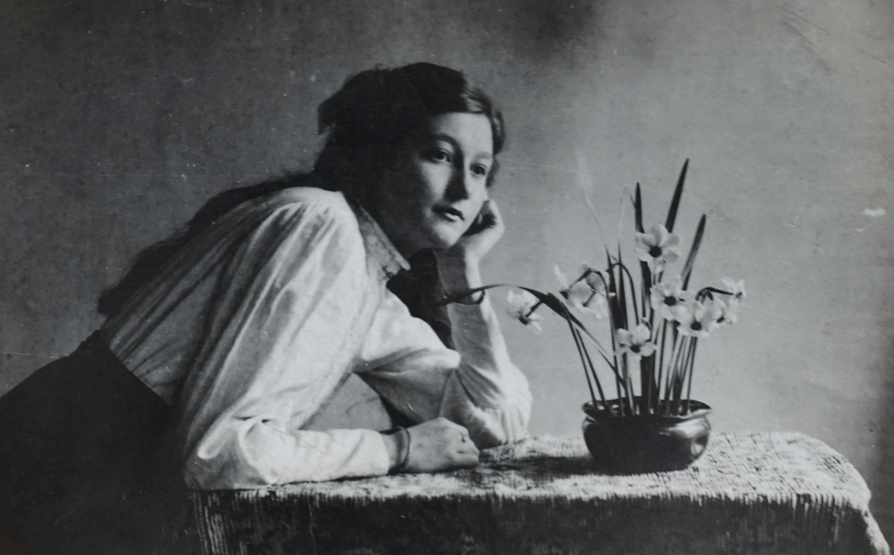

# Cancer Bereavement - A Retrospective

### Each person's encounters with cancer are unique, personal, and often confronting. My own experience is one of bereavement and spiritual entanglement. Here lies the belated retrospective.

###### Photo by Suzy Hazelwood: https://www.pexels.com/photo/woman-in-white-dress-shirt-leaning-on-table-with-flower-vase-3604526/

Each person's encounters with cancer are unique, personal, and often confronting. My own story is one of bereavement and may be challenging if you or someone you love is currently undergoing cancer treatment. My wishes, actions and reflections should not alter or impact anyone else's, each of us have our own journey. Wherever you are on that journey, your feelings are entirely valid. I acknowledge the difficulties you face and pray you and your loved ones recover and remain in good health.

My Mum passed away from breast cancer when I was 17. It's a long time ago now. The pain is still omnipresent but my memories of her and our relationship are slowly but surely fading, less structured and reasonably unreliable. I have felt guilty about this in the past and wished I had the maturity to speak with her authentically as an adult before she died, but alas, I was not, and did not.

My Granddad passed away from prostate cancer a few years after. While I'm sure I saw far less of him than I saw of my Mum, I genuinely wear the wisdom he taught me on my sleeve and in my heart. I loved Granddad dearly, his image is etched into my soul and sometimes on my long drives to and from town, I can feel him with me, sitting beside me, coaching me to be the best version of myself. I loved my time with him, I love him, and always will. 

The one thing you need to know about my Granddad is his relentless support for the underdog, pursuit of fairness, diplomacy and authenticity. I have never met another person with his ethical standards and while I'm sure he made mistakes, like we all do, it was his role-modelling, positive intentions and willingness to be accountable that really set him apart from any other person I've met. When life is hard, having his purity and good intentions channel into my heart feels like being killed with kindness, but it's okay. I'm projecting here, but my posthumous relationship with him makes me feel like a kid again which has led to a lot of inner work and healing. He's never forceful with his suggestions, and he finds a way to point out where I can do a better job, be kinder, more caring or more helpful often when I want others to feel how I'm feeling, he helps me invest that energy wisely. I walked away from spirituality after my Mum died and while I've given it a few attempts since, I owe my recent spiritual journey and growth in part to Granddad's imaginary companionship. Mum and Granddad (from Dad's family), were also great friends and had a beautiful relationship. I'm sure she felt blessed having him there through her cancer journey and would certainly have passed away with a sense of peace and love due to his care and guidance at the time.

When Mum's cancer had gone metastatic it was a difficult time for the whole family. We had prayer circles where the family would gather to pray. I think this is common in religious families and I apologise in advance if what I'm about to say causes any offence to people who find value in prayer circles. Prayer circles may not respond to the needs of each participant in the same way, and it's best to be aware that not everyone approaches such occasions through the same objective lens. Literally standing around in circles, with heads bowed, taking turns to speak out loud with each member of the group saying things like "God receive this life" felt like wishing my Mother away instead of offering productive and tangible support to her in her time of need. I despised it. It felt like a self-righteous, ceremonious and sanctimonious send-off rather than actually doing something useful. Being seventeen and watching my mother rapidly succumb to cancer, I perceived something deeply wrong with the notion of a family doing nothing more than wishing my Mother away. To me, these get togethers were despicable, verging on evil, it all felt deeply at odds with what well-intentioned people from other families might do in response to such grave circumstances. This turned me off of religion and sanctimonious speech.

I do understand now how disempowered families are in the face of terminal illness and that everyone brings something unique to the table. In homes where prayer is seen as an answer, prayer is a significant coping mechanism and is great for everyone's mental health. My repulsion at the time reflected my helplessness, my attachment and disbelief at what was to come rather than the genuine observation of an ill-intentioned family. I'm grateful for the kindness and love shown to my Mum by my family, and I'm really sorry I took their kindness for inaction. It created some ill-feelings that I've since had to heal from and resolve, It may have impacted others too. I hope they find this useful in some way.

I haven't really felt too much guidance from my Mum posthumously, but occasionally I wake up in the middle of the night singing a song or with a song ringing in my ears. One night I woke up at about 4am with "Love Me Do" by the Beetles and I reached for YouTube Music, found the song and played it. What followed were five or six of my Mum's favourite songs including "Baby Did A Bad Bad Thing" by Chris Isaak and some others that I would have to find in my history to recall, but it was glorious, it felt so much like she was with me. I think it's important to enjoy these little moments and celebrate our loved ones. I am so grateful to my Mum for her love and the kind and gentle spirit she had. I recall she was a soft, generous person, sometimes with a bit of an emotional regulation problem (which gives me some clues about something else) but in her regulated form, her heart was undeniably kind, caring and peace loving. She would be over the moon with my life choices at the moment, everything I've achieved and my future aspirations.   

I’m not sure what I would do differently faced with cancer today, this is simply a retrospective on what I’ve grappled with since late childhood and the hidden impact that’s had on some of my family relationships. I prefer to choose tangible action and humane response to adversity. My choice is to pray in memory of loved ones or for guidance rather than towards my direct needs and responsibilities, or in place of being, acting and doing. 

The human in the picture should always be responsible for the action. Our actions should represent what we choose to do and if we want to change the world, it's in our hands to keep physical reality accountable to our inner voice. Ask God for guidance, but don't delegate action to the gods or leave needed actions undone or kept as thoughts, that's simply not how the universe works. There is no action God will take that doesn't also require your courage and bold authentic steps. Prayers are far more meaningful when accompanied by tangible action and your humane, meaningful response.
