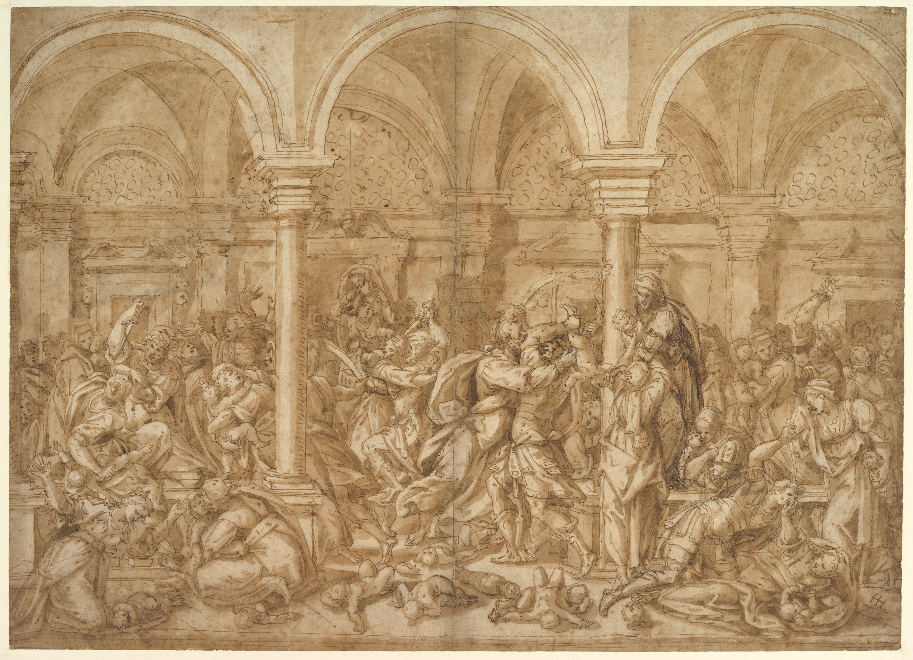

# Mistakes

### Discernment of the potential that lies within our mistakes

###### The Massacre of the Innocents, drawing, Giovanni Battista della Rovere (MET, 63.149 https://upload.wikimedia.org/wikipedia/commons/thumb/3/38/The_Massacre_of_the_Innocents_MET_DP820607.jpg/512px-The_Massacre_of_the_Innocents_MET_DP820607.jpg?20170711211014

### Benefit of Mistakes

Mistakes are chaotic generators of humanity's true potential, an innate part of biological life. Living systems benefit from error in DNA or RNA replication and gene expression because random mutations allow for broader compatibility with a variety of conditions. Living organisms adapt towards environmental suitability through systemic accountability of mistakes. If biological life swept its mistakes under the rug, it would fail to thrive in a variety of conditions and eventually die. It's the making of mistakes which makes life incredibly robust and this is responsible for the continuum of life we belong to.

Kindness and compassion are the products of accepting others suffering. When we see others in pain we naturally want to help them but if we learn their suffering is due to our own actions, it can be hard to acknowledge. We may decide to ignore their suffering or invent narratives about them deserving it. Avoiding our responsibility only serves to deepen the wound. We miss a vital opportunity to discern the truth and this missed opportunity can lead to generational pain, an inaccurate account of history and a departure from our desire for humanity, kindness and compassion. 

Mistakes, serve as experimental lenses into the unknown, granting us accountability to integrate knowledge and use that knowledge to survive. Mistakes are the checkpoints for course correction, where we can apply our learning and adapt to unexpected changes in our psychological environments just like biological life adapts to different ecological or chemical environments. Choosing to openly and honestly respond to our mistakes is our greatest capacity as living beings because they allow for compassionate response to suffering. When we ignore our mistakes, we allow inflexibility and infallibility to undermine survival.

Its ironic that through evolution, we have evolved conscious intelligence with minds that mistakenly believe hiding our errors or lying might be a good idea. Recognising the irony allows us to thrive faced with negative outcomes of our own doing, we can forgive ourselves and expect others to forgive us. Evolution has led to a ~4 billion year continuum that didn't once die out, and we can see that being accountable to mistakes was the only pathway forward. To be delivered a mistake is to be gifted discernment and integrity that leads to our continuation. 

At this time when the world seems more broken than ever, western media is a deceptive smokescreen, and we may be on the cusp of total disaster, this is our greatest chance at success, no matter how humiliating or embarrassing that may seem, integrating our mistakes leads to the best chance of survival.

## Lost Discernment

Societal systems often have inherent expectations regarding our discernment of certain narratives (social norms) which can be institutional and crucial to the coherence of our group. Sense-making under such conditions becomes such an onerous task that group cohesion is the only valid strategy. If misinformation is normalised in these settings, as it is by western governments, the cognitive dissonance of sense-making leads to the inability of individuals to discern anything. In order to think within that structure we must defer our sense-making to it and negative outcomes produced no longer have the potential to be utilised for growth because mistakes cannot be made without destabilising the system. This is an abject loss of discernment, and we must find a way to correct this unhealthy and unsustainable control mechanism that defeats our ability to learn from mistakes and their negative consequences. 

In childhood, we learn to perceive negative outcomes as growth opportunities. Each time we fall off the bike is crucial in developing our discernment of balance, gyroscopic stability, spacial awareness and coordination. As kids, we dream of peace and prosperity for all. Overcoming adversity and living in global harmony feels nothing more than intuitive and trivial. The inequalities of the world are strangely perplexing because we still view our mistakes as our pathway to success, and I think we mistakenly believe that adults haven't diverged away from that fundamental reality. It's only when the social hierarchy that requires our faultlessness becomes our adult pathway to success that we rob ourselves of our true potential as human beings. 

Strong discernment is not based entirely on knowledge acquisition. Information presented to us can be intentionally misleading or emotionally manipulative. Discernment is better established through life experience, acquired through the inherent wisdom of our mistakes. When we are tolerant of our mistakes through truthful acceptance of their negative outcomes, and accept them as inevitable parts of our life, we can learn to love and embrace each mistake as an opportunity leading to beneficial growth and the strengthening of our discernment. The fact that governments and media organisations intentionally cloud the discernment of their populations is a sign of a deeply corrupt system, and we need to act on this to reintroduce radical truth and freedom to make mistakes.

## Psyching Up Negative Outcomes

A mistake is a poorly judged or misguided action that leads to a negative outcome. If you intend harm on others and achieve that outcome, it's not a mistake. For a mistake to be a mistake, the negative outcome should be the result of a lack of discernment or poor judgement. Thus, putting the solution to a mistake within our reach. I am not trying to solve evil or malevolence here, I just want accountability for, and to integrate the learning of mistakes (like adaptive survival in an evolutionary sense). In order to do so, we have to be accepting of the negative outcomes we have caused.

Negative outcomes can be described as the results of an action, characterized by the absence of favourable effect. I view negative outcomes as unexpected but useful byproducts, the result of poor discernment and not premeditated or intentional harm. Negative outcomes do not align with our good intentions or wishes and often leave us feeling disappointed and embarrassed. It's understandable that we can sometimes feel ashamed and try to hide them.

The more we reject infallibility by normalizing mistakes and the possibility that we have caused an unintended negative outcome without fear and judgement, the more we normalize negative outcomes as a launchpad for betterment, repair and resolution. Instead of running away, blaming others or trying to deceive others, let us fully and unapologetically embrace negative outcomes and use them for their highest purpose. Take the opportunity to celebrate growth, accept that mistakes are a natural part of life and the negative outcomes we cause are nothing more than the basis for our expanding wisdom and the guiding foundations for a brighter and more sustainable future for all.

## The Gift Of Improvement

The answer lies in our perception of mistakes. Imagine a world where making a mistake caused a bell to ring, everybody simultaneously stops what they are doing, claps and cheers. A gift toting concierge steps towards you and presents you with a gift hamper, overflowing with various fruits and cheeses, a spa and massage package to be redeemed immediately, and three free sessions with a therapist to help you integrate the psychological lessons of your mistake to better prepare you for future challenges, develop your discernment, and achieving positive outcomes. In that world, every mistake is a gift of improvement. There is no stigma around making mistakes, and we celebrate the growth opportunities which lead to betterment for everyone. Negative outcomes are merely stepping stones to our collective greatness. Those structures that previously abused their monopoly on truth, (like governments), could become the arbiters of truth accelerating human potential rather than stifling it.

My solution might sound ridiculous if you've never achieved or strived for success before. But, successful people will immediately intuit that this is what their mind does (maybe privately) each time they make a mistake. Successful people intuit their mistakes as gifts of discernment and always, without fail, work with them to build their success. A mistake is a growth opportunity. A mistake is success, it is literally the formula to success. Nation states should be able to do this too, but they are so used to hiding mistakes and achieving success at the expense of others, they have diverged beyond their own sustainable reality and all that is left is the house of cards. Imagine if every successful person hid all of their mistakes and misinformed others in order to grow their success into a huge bundle of misinformation, eventually they would fail, eventually the house of cards comes crashing down. We wouldn't call them successful, they are frauds. So in that respect a mistake that has been blamed on someone else or swept under to rug is a lost opportunity to find real success.

It must be possible to transition from the brink of world war and the collapse of western civilisation to a sustainable planet with global harmony. Not just to ceasefire or temporarily end war around the world, but to put an end to exploitation, extraction and all of our violations and human tragedy. Using the potential of our collective intelligence and shared humane ideologies, it seems intuitively plausible that the willingness to embrace our mistakes can lead to something akin to our highest aspirational visions.

# Wrap Up

With our understanding that a mistake is a poorly judged or misguided action that leads to the gift of discernment we can see every negative outcome from the past as a lever of aspirational growth. Every negative outcome no matter how small can be viewed as the platform for our highest aspiration. This leads to radical truth and the importance of maintaining an honest information ecology. My hope here is that even faced with a dishonest and corrupted information ecology we can still develop better powers of discernment simply through accepting and loving our mistakes for what they are and utilising them for their highest potential.

The stigma that perpetuates the cycle of hiding and running from mistakes has to be brought to a close. In reality mistakes are a part of healthy growth and aspirational thinking. The more acceptance of mistakes, the less hiding of our mistakes there can be. The more truth there is, the less deception there can be. The more discernment there is, the more wonderful our world can be.

May you live in peace and kindness for all living things.

